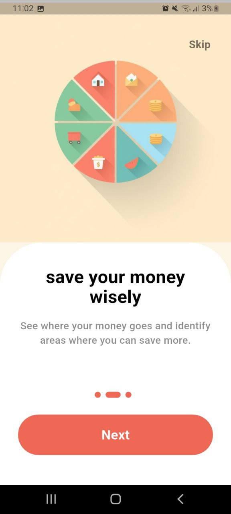
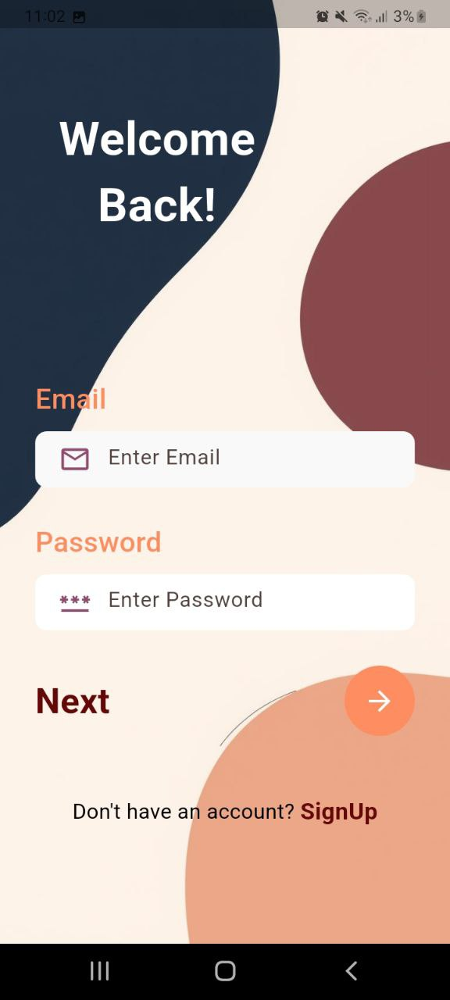
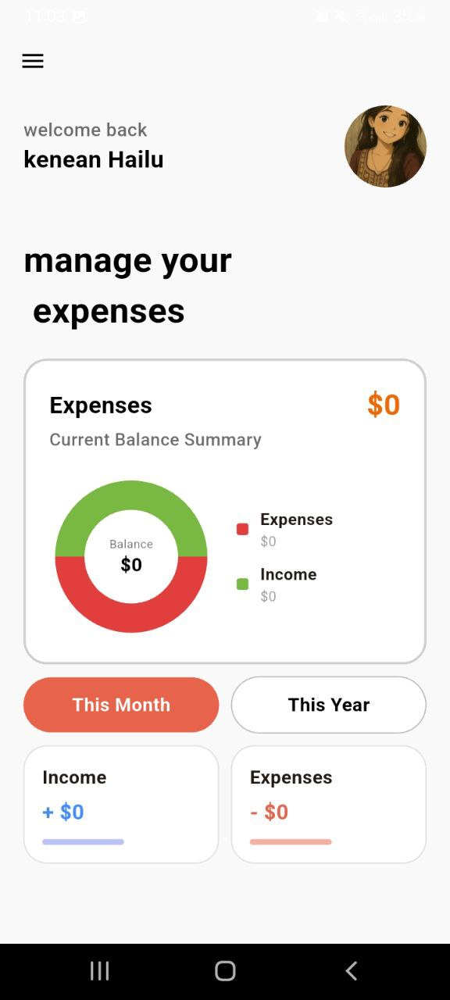

# 💸 Expense Tracking App

A modern, high-performance personal finance management application built with **Flutter** and **Firebase**. This app allows users to track their daily expenses and income with real-time data visualization.

## ✨ Features

- **User Authentication:** Secure Sign-up and Login using Firebase Email/Password Auth.
- **Real-time Dashboard:** View total expenses and income synced with Cloud Firestore.
- **Data Visualization:** Interactive Donut Charts (via `fl_chart`) showing expense breakdowns by category (Shopping, Grocery, Others).
- **Local Storage:** Remembers user sessions and preferences using `shared_preferences`.
- **Responsive UI:** Clean, modern design with a landing onboarding experience.
- **Category Tracking:** Add expenses to specific categories to manage budgets effectively.

## 🚀 Tech Stack

- **Frontend:** [Flutter](https://flutter.dev/) (Dart)
- **Backend:** [Firebase Authentication](https://firebase.google.com/products/auth), [Cloud Firestore](https://firebase.google.com/products/firestore)
- **Charts:** [fl_chart](https://pub.dev/packages/fl_chart)
- **State Management:** Stateful Widgets & Service-based architecture

## 📸 Screenshots

| Onboarding | Login | Dashboard |
|------------|-------|-----------|
|  |  |  |

---

## 🛠️ Installation & Setup
